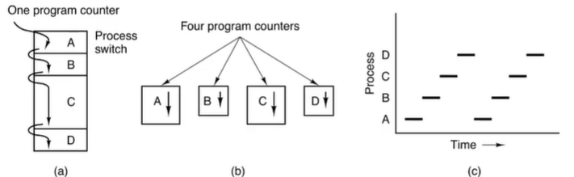
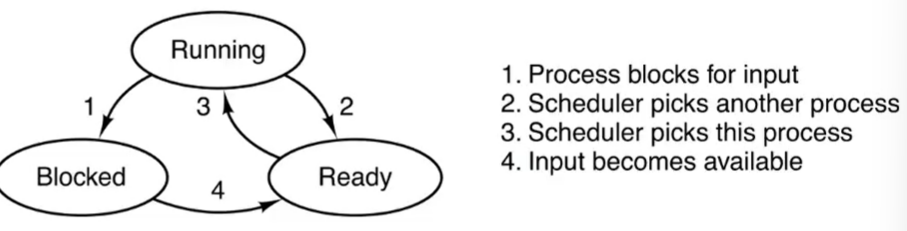

# Process Management

- Pseudoparallelism - only one CPU core
  - 
- Content switching
  - Stop one process to start another
- Scheduling

## Process States

- Run
  - **Definition**: Currently running, CPU is executing
- Ready
  - **Definition**: Ready to be ran and OS is ready to schedule
  - Newly created process is considered ready
- Block
  - **Definition**: Process has been forbidden from running for some reason must be unblocked to be scheduled and ran
- **Ex:**
  - `% cat chap1 chap2 chap3 | grep tree`
  - **cat**: concatenates files together
  - **|**: pipe, output of first command goes into second
  - Processes
    - Shell will fork off cat
    - Shell will fork off grep
    - A pipe will be formed between the two of them

  ``` txt
    Shell
   /     \
  cat====grep
  ```

  - States:
    - Shell is in the block state
      - Condition: waiting for the two processes to finish
    - If grep is scheduled to run first, it will transition to the run state
    - It will try to read through the pipe. Since cat has not run yet, the process will move from the run state to the block state
      - Condition: waiting for I/O
    - Cat will be scheduled to run, putting data into the pipe
    - Now that grep has data to read in the pipe, it will become unblocked and moved to ready state
      - Cat is running, grep is waiting
  
## Transitions



- Ready to run
  - OS decided process is able to be ran
- Run to block
  - Process has been deemed unable to be ran for some reason
- Block to ready
  - Process is now ready to be run again, now the scheduler must handle if it transitions directly to run, or if it needs to wait
- Run to ready
  - Time slice: OS has decided a process has run for long enough
- Run can transition to terminate
  - process has ended
