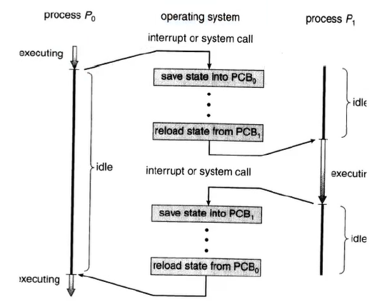

# Process Details

- Process table
  - Contains data about every process in the OS
  - Process context:
    - Progression counter
    - Registers
    - Process status word (PSW)
    - Stack pointer
    - Process State
    - Priority
    - Status of open files
    - Process ID
  - Also called Process Control Block (PCB)

## Context switching

