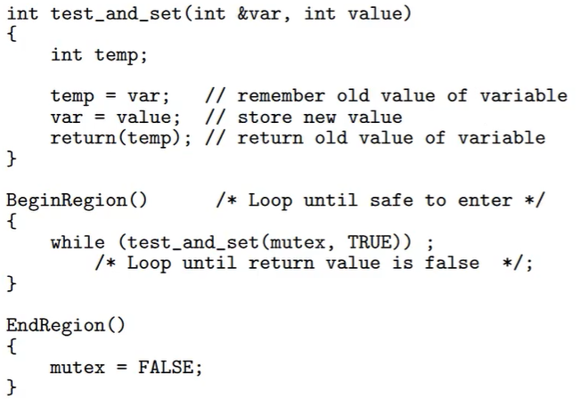
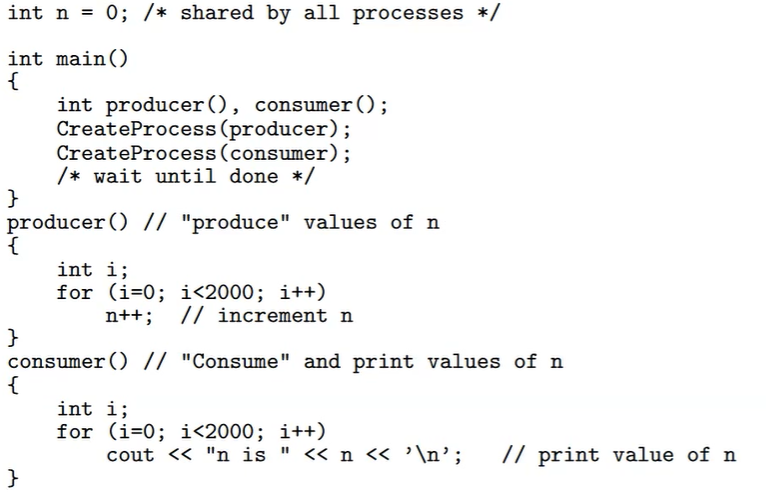

# Process Coordination

## Mutual exclusion

- Ensure two (or more) concurrent activities do not gain access at the same time
- Solution should satisfy:
  - Mutual exclusion
  - Environment independent
    - Should work regardless of environment 
  - Resources shared only in critical region/section
    - Set of instructions to access shared resource
    - Critical region is the section of code that actively accesses the resources
  - Bounded waiting
    - Process will gain access to resource in a bounded/finite amount of time

### Situations

- Deadlock
  - Two process each have one of the resources the other needs
  - Both processes need both of the resources to function, so each indefinitely wait for the resource the other has to be freed
- Starvation
  - Trying to access a resource that has no more operational space

### Solution - Disable Interrupts

- Whenever we enter the critical region we disable interrupts
- When we leave critical region, we reenable them
- This prevents ANYTHING from interrupting the process, even ones unrelated to resource critical region is using
- Does not work on a multi-core CPU
- Mutex locking aka "spinlock"
  - While mutex variable is true, something is in the critical region
  - Code will run once mutex is false
  - Done with a while true loop that "busy-waits" until mutex is false
  - This solution can break if multiple processes are waiting for mutex to be false.
    - In MOST cases, one process will run before the other due to memory serialization, but it can break and have both waiting processes spin up at the same time.
  - Can be fixed by using a 'test and set' instruction
    - 
    - This new solution will not have the same edge case scenarios as a normal spinlock.
    - This also works on a multicore cpu
  
## Synchronization

- Condition to coordinate the actions of processes
- Variable n - initialized to 0
- Producer Process
- Consumer Process
- 

