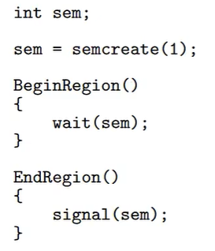
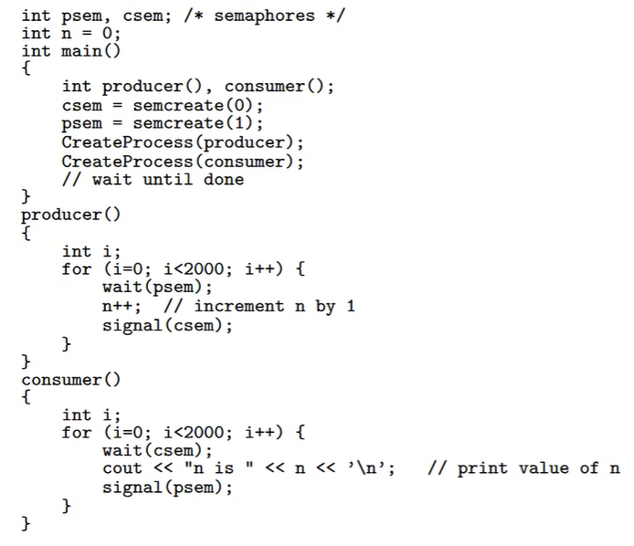

# Semaphore

Abstract entity provided the OS

- Positives:
  - Processes do not busy wait when waiting for resources
  - Works for single and multi processor systems
  - Users control their synchronization
    - Can also be a drawback b/c higher chance for user error

## Counting Semaphores

- Named semaphore id
- tuple (id, count, queue)
  - Non-negative count means the queue is empty
  - Count of -n means n waiting processes
  - Count of +n means we have n available resources

## Semaphore Operations

- Sem = semcreate(val)
  - creates a semaphore with count of val
- semdelete(Sem)
  - Delete semaphore
- wait(Sem) (aka down, or p)
  - waiting on a semaphore
  - Decrement the semaphore count
  - If we have a negative count, then suspend (block) the process
- signal(Sem) (aka up, or v)
  - Increments the semaphore count
  - Allows 1 process in queue to proceed

## Semaphore Mutual Exclusion

- 

## Semaphore Synchronization

- 
