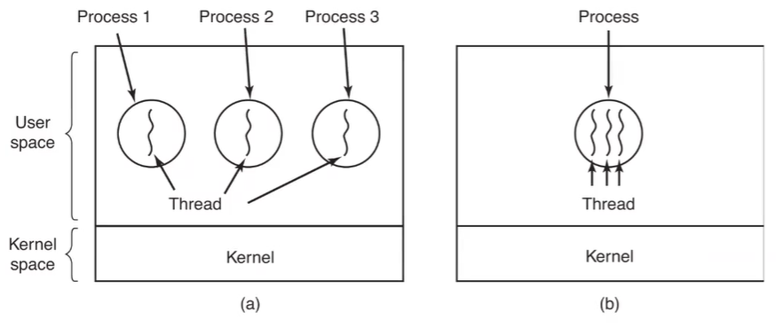

# Threads

- Smaller and more focused section in a process
- All that applies to processes applies to threads
- 

## Items

- Per-process (all threads will have these)
  - Address space
  - Global variables
  - Open files
  - Child processes
  - Pending alarms
  - Signal and signal handlers
  - Accounting information
- Per-thread
  - Program counter
  - Local Variables
  - Registers
  - Stack
  - State

## Threads vs processes

- (+) Threads require less resources to create than a process.
- (+) Switching between threads is easier
- (+) Sharing resources in threads are easier
- (-) Threads have a lack of protection between them
  - If one thread has a seg. fault, all will fail. 
- (-) Threads all execute the same code

## User-level-threads

- Library ran at user level
- No OS support required