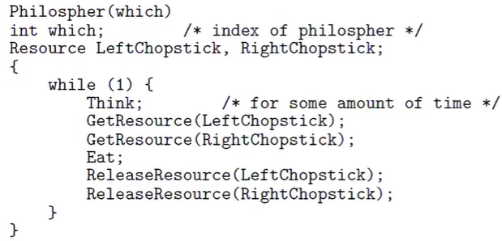

# Mutex with **monitor**
- Provided by the programming language
- A monitor is similar to synchronism in js
- Producer/consumer with monitors:
  - 
  - -

## Guard procedure

- Only accessed and ran by one process/thread at a time

## Conditional Variables

1) wait(condition) - wait
- until another process signals condition
2) signal(condition)/notify() - allow up
- to one waiting process to proceed

## Coordination type: Message Passing

- Direct 
  - Send (destpid, msg)
  - receive (srepid, msg) 
- Indirect
  - mailbox/ports  
- Design issues
  - Buffering
  - Blocking/non-blocking operations
    - Wait or send error if no mail? same goes for if mailbox is full 3
- 
- 
  - No process can move beyond barrier until every process has reached the barrier

## Classic problem 

### Dining philosophers problem
5 Philosophers sitting at a round table with a plate of noodles and one chopstick on either side. Once a philosopher decides they are ready to eat, they take the chopstick to their right and left.

- 
  - If each two philosophers next to each other decide to eat at the same time, one of them will be unable to progress
  - Race condition/deadlock as both processes need the chopstick to continue. Resource starvation

### Reader/Writer problem
- Shared resource and 5 processes trying to gain access to that resource.
- Two of these processes are writers, and 3 are readers.
  - If multiple readers have access, that is fine as none of them would be able to modify the resource.
  - If a writer is present, there can be no other readers or writers accessing the resource.
  - A writer needs to gain access even when readers are there, denying further access to readers.f
