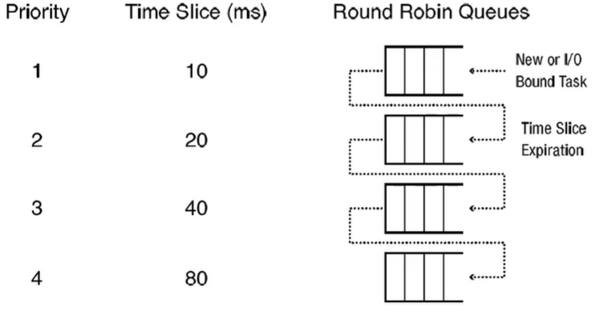

# Scheduling (processes)

- When to run?
  - After process creation/termination
  - a process blocks
  - interrupt handled

## Short vs Long process

- How long does a process run when scheduled
- Short: Processes that are interactive (uses i/o or user input)
  - Relatively short time in 'run' state before they block to wait for IO
- Long: CPU intensive tasks
  - Compute many digits of pi

## Criteria

- Fairness:
  - CPU gives fair share to all processes
- Efficiency:
  - keep cpu busy with user tasks
- Response time

## Measurements

- Execution time (t)
  - Time spent in run state
- Response time (T)
  - Wall-clock time
  - Finish - start time
- Kernel time
  - Spent executing kernel code
- System time
  - kernel time devoted to a process
- User time
  - time CPU spent executing user-level code
- idle time
  - time spent running idle process
- Voluntary switch
  - From run to Block (waiting for I/O)
- Involuntary switch
  - From run to ready when OS either time slices or scheduler has higher priority task that needs to run

## Policies

- first come first serve (FCFS)
  - Non-preemptive policy
  - easy to implement
  - efficient
  - Not necessarily fair 
  - indefinite loops have no way to be broken out of
- Round robbin
  - Ordered queue of ready processes
  - Pick first to run, has a time quantum q 
    - Maximum amount of time a process can run before it must give up the cpu
    - Once reached, an involuntary context switch occurs 
  - If Q is too large, not a fair process
  - If Q is too small, its inefficient
- Shortest process next (spn)
  - Uses historical processes to guess how the current one will run
  - Esmoothaverage = aEsmooth + (1-a)Emeasure
  - a = [0, 1)
    - a = 0 : only use recent value
    - a -> 1 : average changes slowly
  - Fast response time for short processes
  - Bad response time for long processes
    - Could lead to starvation if there are always shorter processes being added to the queue.
- Multiple-level feedback queue (MLFQ)
  - 

## Multiprocessors

- Affinity scheduling
  - Same process may have an affinity for a particular processor
  - Try to repeat scheduling of a process on the same processor
  

## Linux

- "Real-time" processes
  - Processes marked as real time have priority over normal processes
- Normal processes
  - Credit-based policy
  - When a process has more credits, it has more priority
  - credits are awarded in a relation to how much time it uses compared to how much it was allocated
- now has a completely fair scheduler

## Evaluating policies

1) Mathematical analysis
- Queueing theory
2) Simulator
- trace driven
  - take data from real systems and compare with/without policy
3) Experimentation
- Build the scheduler and replace the old one and evaluate distance.
- Would most likely try to justify efforts with first two as to not waste effort