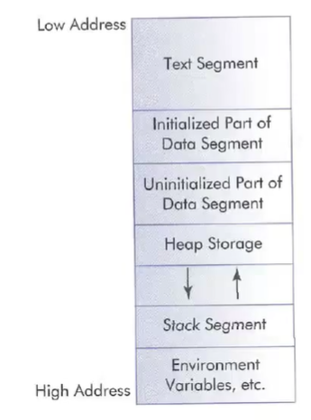
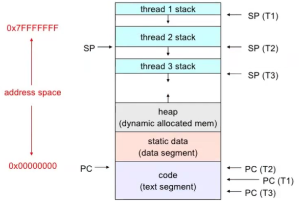

# Memory Management - Process Memory

## Address space of a process

- Starting at index 0
- Once the first 3 are complete, the size is final and cannot be altered.
- Stack and Heap can grow in size
1) Code - "text"
   - The compiled instructions
   - This takes up as much memory as your compiled code needs
2) Initialized Global Data
   - Initialized variables
   - Strings
     - Pointer of a defined string is passed to the print statement
3) Uninitialized global data
   - Global variables that have not been defined
4) Heap
   - new/malloc
     - `new char[128]` is the same as `(char *)malloc(128)`
   - Dynamically allocated memory
   - Grows upwards from the end of the 'Uninitialized global data' memory block
5) Stack
   - Local variables
   - Grows downwards from the end of the allocated memory
6) Environment variables
- 
- 
