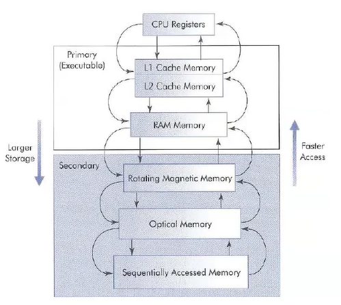
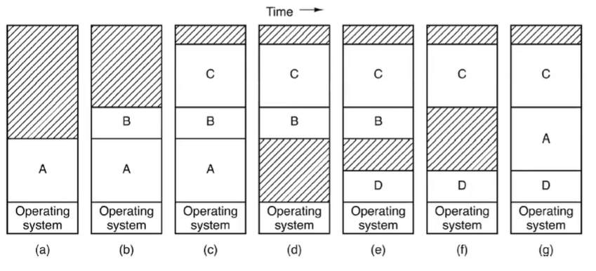
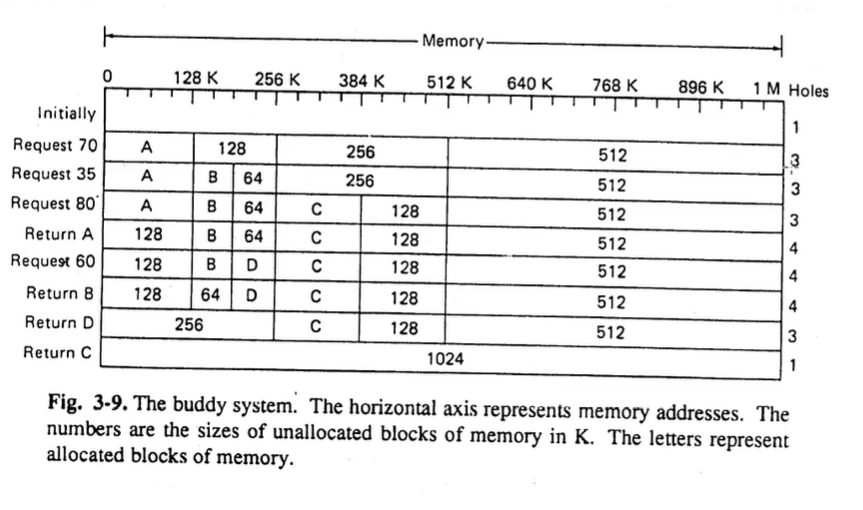

# Memory Management Overview

## Issues

- Unbounded demand
- Protection vs sharing
  - Ensuring address space of different programs are kept protected from each other.
  - In other cases, we might want to share memory/code when multiple process are running off of the same compiled code
- Dynamic memory requirements
  - Unknown size of heap and stack

## Hierarchy of Storage

- Rotating magnetic memory could also be SSDs and other storage devices akin to such.
- os runs in ram and rotating magnetic storage
- Thrashing:
  - Too much time spent transferring between primary and secondary storage

## Generic Memory Management

### Problem

- Assume we have a chunk of memory we want to manage
- Two types of request:
  - 1: ptr = getmem(size)
    - Asking to allocate memory of specific size and return address
    - same as new keyword or malloc
  - 2: freemem(ptr)
    - Free allocated memory
    - same as delete keyword and free()

### Solutions

1) Bitmap approach

- 1024 bites in 8 equal chunk (128 bytes)
- Associate a bit with each chunk of memory
  - each chunk will be initialized with 0 (indicating it is not in use)
- getmem:
  - round up our request size to an int# of chunks
    - ex: request for 300 bytes will have to be rounded up to 3 chunks worth of bytes (384)
  - **Internal fragmentation**:
    - Back to our example, the wasted space at the end of the 3rd chunk is wasted. This is called internal fragmentation
    - can be solved by changing the chunk size
  - Each of the three chunks will have their first bit set to 1

2) Boundary tag/Linked list approach

- Keep a doubly-linked list of 'pieces'
- status of each piece is used/unused (represented by a single bit of 0/1)
- Also contains the start/end of the piece
- This solution has potential for **external fragmentation**
  - Memory that is allocated to the program, but is too small to be useful.
- getmem:
  - Searches the available list to find one that is large enough
  - divides the pieces as needed
    - No internal fragmentation
- freemem:
  - Recombines the pieces as possible
- 
  - Memory at the top of the diagram is **external fragmentation**

3) Buddy System

- Effectively, recursively divide segments by 2 until you get one that is of an adequate size.
- when two 'buddies' of the same size are free, they combine into teh highest size possible. As shown when B and D are returned.
- This does result in internal fragmentation as sizes are still being rounded up.
  - No more than double the size of the request.
