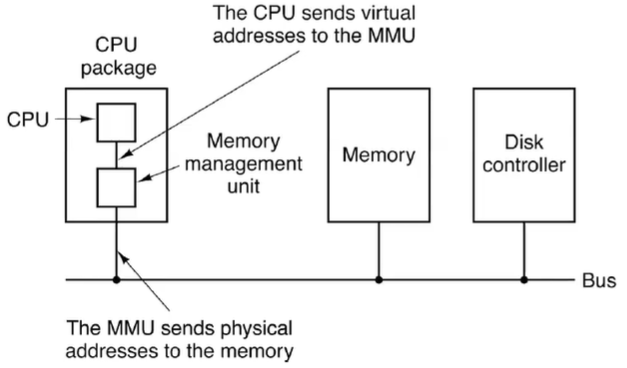
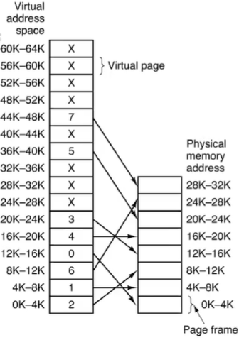
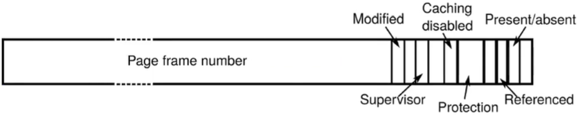

# Virtual Memory Management

- Physical addresses refer to physical memory (RAM)
- Virtual addresses are storage as viewed by processes
  
## Memory Management Unit (MMU)
- 
- Translation of virtual addresses to physical addresses
- Translation Lookaside Buffer (TLB)
  - A cache of page -> frame mappings

## Size of V.A vs P.A space ex
- 32-bit addresses
  - 2^32 addresses => 4GB of address space
  - 2^64 addresses => 16 Exabyte
- Every process can be allocated 4GB of virtual memory
- Say we only have 8gb of physical memory
- If we have >2 programs using 4GB virtual memory, how does this work with the RAM?
  - It doesn't, but...
  - Processes don't always use all 4gb
  - Only a portion of VA space for a process is in memory at a time

## Virtual Memory with Paging
- Virtual addresses of a process divided into fixed size **pages**
- Virtual address composes of a page number & page offset
  - 32-bit address contains a number and an offset
  - Offset depends on the size of the page (the amount of bits)
    - Bit = 2^x where x is the amount of bytes
- Physical memory divided into fixed-sized **frames** (or pageframes)
- Size of page & frame is the same
- 

## Address Translation
- Extract the pace number from virtual address (show page|offset). 
- Access appropriate page table entry
- If page is not in memory, **page fault**
- If address violation, 'protection violation' or segmentation violation
- Finally return physical address (frame number * page size + offset)

## What happens during a page fault
- Assuming the OS has pageFaultHandler()
  - GetFreeFrame - the segments of memory needed
  - Determine location of page
    - Disk mapping table (pid, page, disk addr)
    - bsloc(pid, page) returns disk addr
  - Major page fault = os requires the information being read in from disk
  - Minor page fault = stack and uninitialized data page would not need to be read, but will need to be zero-filled and used

## What happens when there are no free frames?

- We must remove one or more entries from physical memory. OS uses its page replacement policy.
- Given a page that is selected for removal:
  - Mark the page as no longer present in page table
  - If not modified, then can simply put free frame back in the pool
  - if page is modified, schedule the page for writing
    - Swap space/swap file is where these will be written to.
  - If the page that is being written is accessed again, we would like to reclaim it (different kind of minor fault)