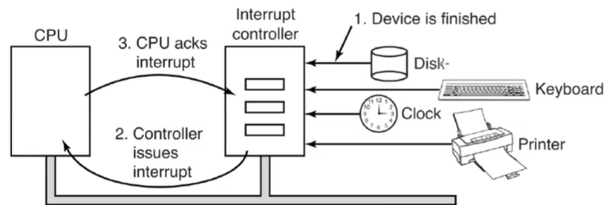
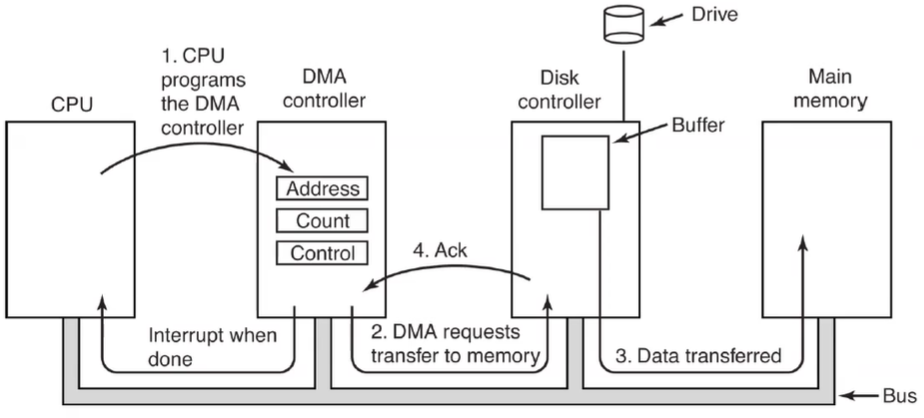

# IO Devices

- Two principal types:
  - Block device
    - read/write blocks
    - can seek - go to an arbitrary location on the device
    - ex: disks
  - Character devices
    - read/write stream of bytes
    - cannot seek
    - ex: network
- There are also clock devices

## Device Controllers

- How the OS interacts with the device
- Interrupts:

- Direct Memory Access:

  - Allows a device to interface with the memory without the CPU being directly involved
  - Pages being transferred into must be locked
