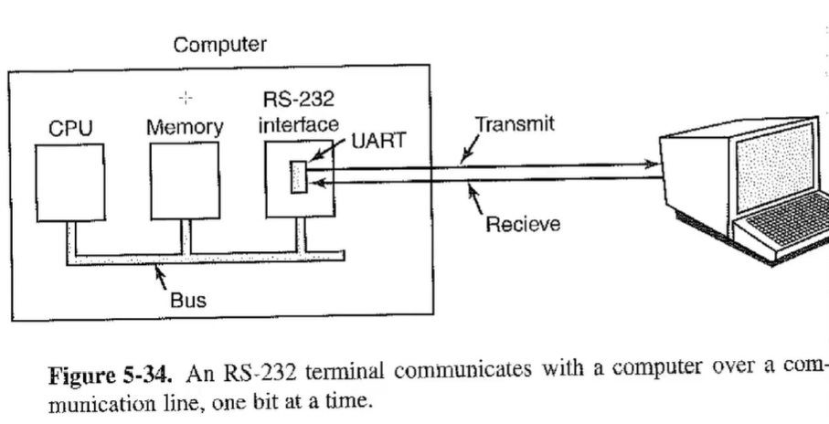

# Terminal Devices and Drivers

## Device drivers - Generic organization

- Upper half
  - Invoked based upon request
  - This half is allowed to block when it cannot immediately satisfy a request
- Shared buffer
  - Both halves have access to this buffer.
  - The halves communicate by putting stuff into this buffer
- Lower half - Interrupt handler
  - Invoked upon an interrupt from the device.
  - This half **cannot** block - it *must* run to completion
