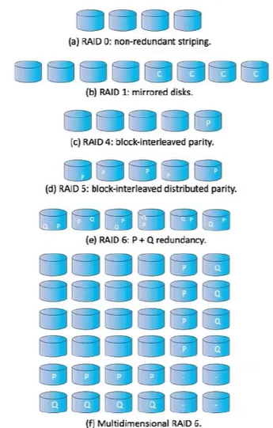

# Disks

- Physical representation of files
- The majority of files are small
- We also need to allow for larger files
- Magnetic Disks have a seek time
- SSDs are made of flash storage
  - Reads are faster than writes
  - Flash friendly filesystem (F2FS) are beginning to take advantage of this new tech

## Reliability

Problems can happen, what happens when we loose things?

- Log-structure filesystems / Journaling
  - All actions will be logged so the OS knows what is occurring incase of a crash or failure.
  - When system reboots, it can see this log and make those updates/verifies that they have occurred
  - Increases reliability, though slows down speeds
- RAID - Redundant Array of Independent Disks
  - 
  - C is a copy
    - Just a plain copy of one disk
  - P is a parity
    - a sort of compression where a disk contains values to recover other disks
  - RAID 1:
    - Mirrored disks, can technically increase speed of reads, but slows down writes
    - Each write occurs on two disks at once
  - RAID 4:
    - Parity must be computed after every write
    - Each disk contains values that helps recover a disk if one has failed when computer alongside the parity
