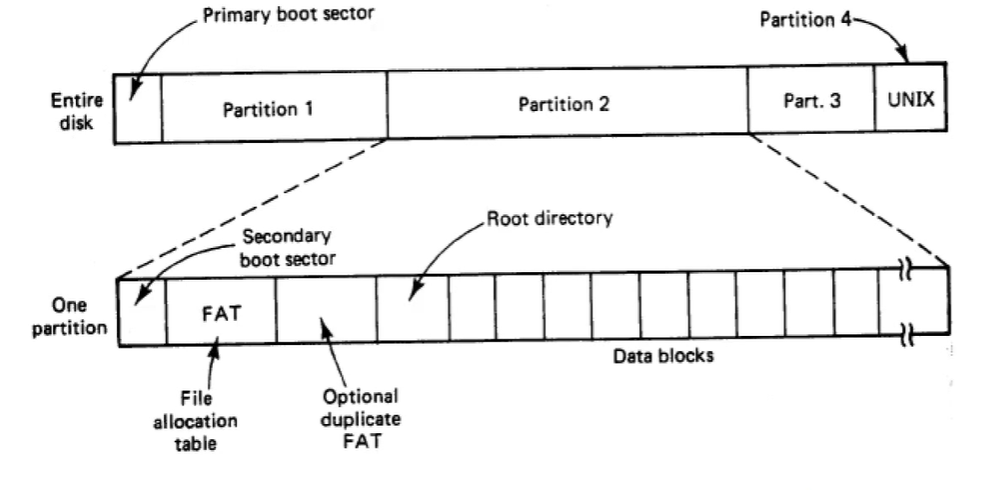
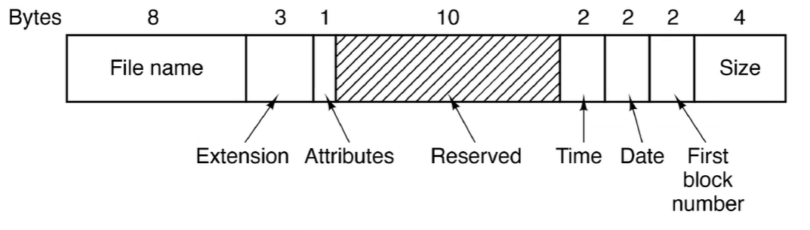
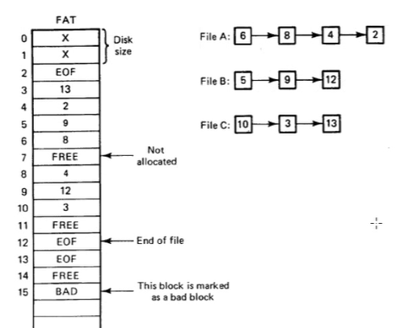
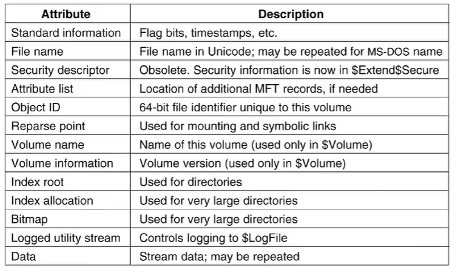
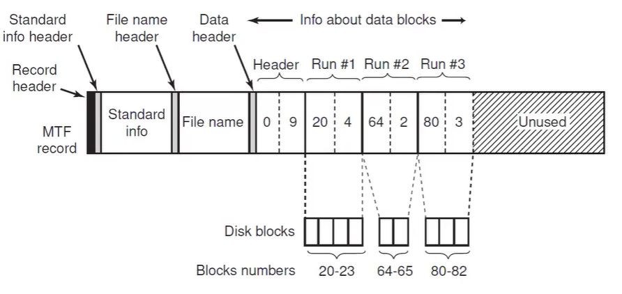
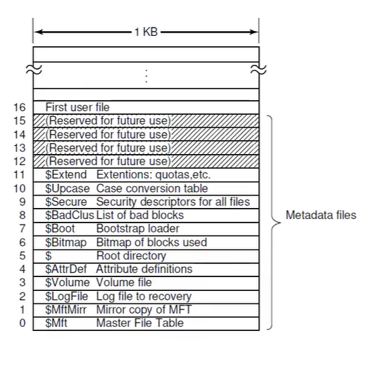
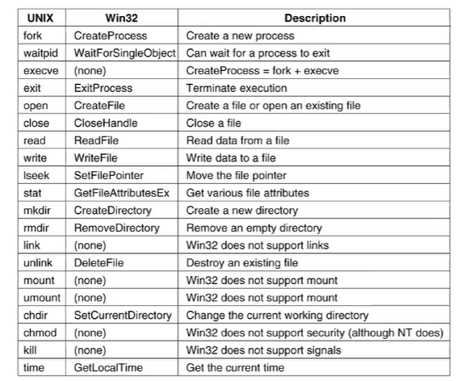

# Windows File Systems

## FAT

- File allocation Table
- Introduced with MS-DOS
  - Still widely used with storage devices

- Structure of a Directory Entry:

- File allocation table

## NTFS

- Volume = partition
- Cluster = block
- Master file table (MFT)
  - One MFT entry per file
  - Stores standard info/attributes (timestamp/size)
    - 
  - File name - stored in unicode (16-bit)
  - Security info
  - Data for files
    - 
  - 

- Win32 API file/directory functions
  - 
